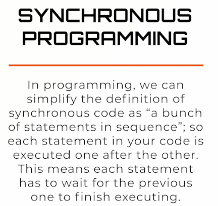
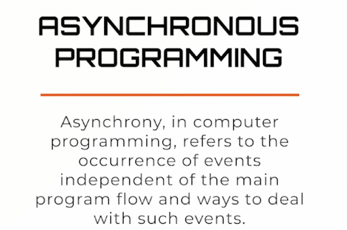
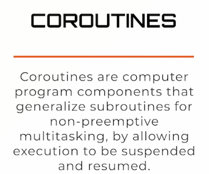
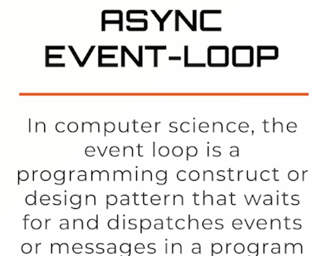

# About Python Asynchronous Programming - Asyncio & Async/await

- async and await keywords
- co-routines
- futures and tasks
- asyncio module
  
  
  
- A co-routine is simply a wrapped version of a function that allows it to run asynchronously
  
