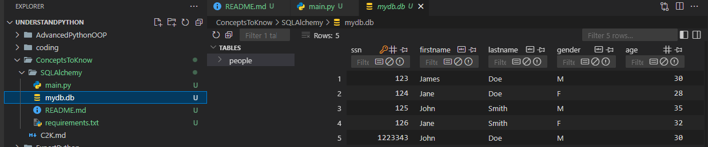
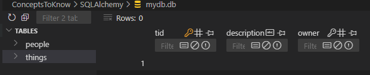

# About SQLAlchemy

- It's an SQL toolKit , an Object relational Mapper (ORM) , a python module that allows us to map python classes & objects to database tables and entries.
- `pip install sqlalchemy`

```
$ python main.py
C:\Users\abhis\Desktop\PythonDev\LearnPython\UnderstandPython\ConceptsToKnow\SQLAlchemy\main.py:22: MovedIn20Warning: The ``declarative_base()`` function is now available as sqlalchemy.orm.declarative_base(). (deprecated since: 2.0) (Background on SQLAlchemy 2.0 at: https://sqlalche.me/e/b8d9)
  Base = declarative_base()
2024-11-05 23:07:26,931 INFO sqlalchemy.engine.Engine BEGIN (implicit)2024-11-05 23:07:26,931 INFO sqlalchemy.engine.Engine PRAGMA main.table_info("people")
2024-11-05 23:07:26,931 INFO sqlalchemy.engine.Engine [raw sql] ()
2024-11-05 23:07:26,932 INFO sqlalchemy.engine.Engine PRAGMA temp.table_info("people")
2024-11-05 23:07:26,933 INFO sqlalchemy.engine.Engine [raw sql] ()
2024-11-05 23:07:26,935 INFO sqlalchemy.engine.Engine
CREATE TABLE people (
        ssn INTEGER NOT NULL,
        firstname VARCHAR,
        lastname VARCHAR,
        gender CHAR,
        age INTEGER,
        PRIMARY KEY (ssn)
)


2024-11-05 23:07:26,935 INFO sqlalchemy.engine.Engine [no key 0.00040s] ()
2024-11-05 23:07:26,940 INFO sqlalchemy.engine.Engine COMMIT
2024-11-05 23:07:26,944 INFO sqlalchemy.engine.Engine BEGIN (implicit)2024-11-05 23:07:26,946 INFO sqlalchemy.engine.Engine INSERT INTO people (ssn, firstname, lastname, gender, age) VALUES (?, ?, ?, ?, ?)
2024-11-05 23:07:26,946 INFO sqlalchemy.engine.Engine [generated in 0.00042s] (1223343, 'John', 'Doe', 'M', 30)
2024-11-05 23:07:26,948 INFO sqlalchemy.engine.Engine COMMIT
2024-11-05 23:07:26,953 INFO sqlalchemy.engine.Engine BEGIN (implicit)2024-11-05 23:07:26,954 INFO sqlalchemy.engine.Engine INSERT INTO people (ssn, firstname, lastname, gender, age) VALUES (?, ?, ?, ?, ?)
2024-11-05 23:07:26,954 INFO sqlalchemy.engine.Engine [generated in 0.00042s] [(123, 'James', 'Doe', 'M', 30), (124, 'Jane', 'Doe', 'F', 28), (125, 'John', 'Smith', 'M', 35), (126, 'Jane', 'Smith', 'F', 32)]
2024-11-05 23:07:26,956 INFO sqlalchemy.engine.Engine COMMIT
```

```
To view a SQLite database in Visual Studio Code (VSCode), you can follow these steps: [1]

Install the SQLite Viewer extension: [2]

Open VSCode

Go to the Extensions view (Ctrl+Shift+X or Cmd+Shift+X on Mac)

Search for "SQLite Viewer"

Install the extension
```

- so we can see the things we created on vs code better
  

- we can also `query objects`

```
2024-11-05 23:18:31,257 INFO sqlalchemy.engine.Engine BEGIN (implicit)
2024-11-05 23:18:31,260 INFO sqlalchemy.engine.Engine SELECT people.ssn AS people_ssn, people.firstname AS people_firstname, people.lastname AS people_lastname, people.gender AS people_gender, people.age AS people_age
FROM people
2024-11-05 23:18:31,260 INFO sqlalchemy.engine.Engine [generated in 0.00055s] ()
(123) James Doe (M, 30)
(124) Jane Doe (F, 28)
(125) John Smith (M, 35)
(126) Jane Smith (F, 32)
(1223343) John Doe (M, 30)
```

- filter the query

```
2024-11-05 23:22:07,722 INFO sqlalchemy.engine.Engine SELECT people.ssn AS people_ssn, people.firstname AS people_firstname, people.lastname AS people_lastname, people.gender AS people_gender, people.age AS people_age
FROM people
WHERE people.age > ?
2024-11-05 23:22:07,723 INFO sqlalchemy.engine.Engine [generated in 0.00058s] (30,)
Filtered Results: [(125) John Smith (M, 35), (126) Jane Smith (F, 32)]
```

- using in\_

```
2024-11-05 23:25:12,659 INFO sqlalchemy.engine.Engine SELECT people.ssn AS people_ssn, people.firstname AS people_firstname, people.lastname AS people_lastname, people.gender AS people_gender, people.age AS people_age
FROM people
WHERE people.firstname IN (?, ?)
2024-11-05 23:25:12,659 INFO sqlalchemy.engine.Engine [generated in 0.00077s] ('John', 'Jane')
Filtered Results: [(124) Jane Doe (F, 28), (125) John Smith (M, 35), (126) Jane Smith (F, 32), (1223343) John Doe (M, 30)]
```

# Let's add a foreign key relationship

```
2024-11-05 23:33:33,222 INFO sqlalchemy.engine.Engine PRAGMA temp.table_info("things")
2024-11-05 23:33:33,222 INFO sqlalchemy.engine.Engine [raw sql] ()
2024-11-05 23:33:33,225 INFO sqlalchemy.engine.Engine
CREATE TABLE things (
        tid INTEGER NOT NULL,
        description VARCHAR(32) NOT NULL,
        owner INTEGER,
        PRIMARY KEY (tid),
        FOREIGN KEY(owner) REFERENCES people (ssn)
)
```



- add data into things

```
p6 = Person(127, "John", "Doe", "M", 90)
t1 = Thing(1, "Car", p6.ssn)
session.add_all([p6, t1])
session.commit()
```

-- output

```
$ python main.py
C:\Users\abhis\Desktop\PythonDev\LearnPython\UnderstandPython\ConceptsToKnow\SQLAlchemy\main.py:22: MovedIn20Warning: The ``declarative_base()`` function is now available as sqlalchemy.orm.declarative_base(). (deprecated since: 2.0) (Background on SQLAlchemy 2.0 at: https://sqlalche.me/e/b8d9)
  Base = declarative_base()
2024-11-05 23:38:44,690 INFO sqlalchemy.engine.Engine BEGIN (implicit)
2024-11-05 23:38:44,691 INFO sqlalchemy.engine.Engine PRAGMA main.table_info("people")
2024-11-05 23:38:44,691 INFO sqlalchemy.engine.Engine [raw sql] ()
2024-11-05 23:38:44,692 INFO sqlalchemy.engine.Engine PRAGMA main.table_info("things")
2024-11-05 23:38:44,692 INFO sqlalchemy.engine.Engine [raw sql] ()
2024-11-05 23:38:44,693 INFO sqlalchemy.engine.Engine COMMIT
2024-11-05 23:38:44,700 INFO sqlalchemy.engine.Engine BEGIN (implicit)
2024-11-05 23:38:44,707 INFO sqlalchemy.engine.Engine INSERT INTO people (ssn, firstname, lastname, gender, age) VALUES (?, ?, ?, ?, ?)
2024-11-05 23:38:44,710 INFO sqlalchemy.engine.Engine [generated in 0.00273s] (127, 'John', 'Doe', 'M', 90)
2024-11-05 23:38:44,724 INFO sqlalchemy.engine.Engine INSERT INTO things (tid, description, owner) VALUES (?, ?, ?)
2024-11-05 23:38:44,726 INFO sqlalchemy.engine.Engine [generated in 0.00062s] (1, 'Car', 127)
2024-11-05 23:38:44,726 INFO sqlalchemy.engine.Engine COMMIT
```

- a query to give all things owned by person p6

```
2024-11-05 23:48:09,115 INFO sqlalchemy.engine.Engine SELECT things.tid AS things_tid, things.description AS things_description, things.owner AS things_owner, people.ssn AS people_ssn, people.firstname AS people_firstname, people.lastname AS people_lastname, people.gender AS people_gender, people.age AS people_age
FROM things, people
WHERE things.owner = people.ssn AND people.firstname = ?
2024-11-05 23:48:09,115 INFO sqlalchemy.engine.Engine [generated in 0.00055s] ('John',)
(3 Boat owned by 125, (125) John Smith (M, 35))
(5 Plane owned by 127, (127) John Doe (M, 90))
(6 Rocket owned by 127, (127) John Doe (M, 90))
(7 Ship owned by 1223343, (1223343) John Doe (M, 30))
```
