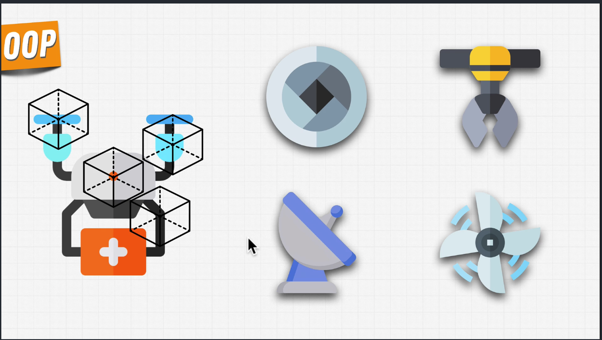

# Advanced Python : Object Oriented Programming

- what's OOP? - done
  - Everything in python is an object.
  - we can break down the drone delivery into small pieces and each developer can work on small objects like one works on propellers, other works on camera, pickup package .. likewise then we combine them all the custom objects together.
    
- Creating our own objects - done
- Attributes & Methods - done
- init dunder method - done
- @classmethod & @staticmethod - done
- Dev Fundamental Notes
- Encapsulation
- Abstraction
- Private & public variables
- Inheritance
- Polymorphism
- super()
- Object Introspection
- Dunder methods
- Multiple inheritance
- MRO: method resolution order.
